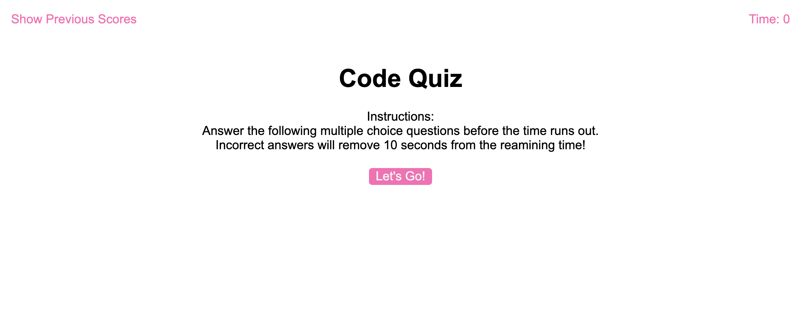

# code-quiz Web Application

## This is a short quiz about javascript that tests beginner knowledge

**Features:**
1. Total Allowed Time is calculated based as number of questions * 15 secs
2. Timer counts down to Zero
3. Responses must be chosen from a list of presented options
4. After a response is clicked, user is breifly notified is chosed response is CORRECT or INCORRECT
5. A new question is then automatically presented
6. Each incorrect answer subtracts 10 secs from Total Allowed Time
7. Quiz ends when all questions have been answered or Total Allowed Time runs out
8. Remaning Time equals players score
9. Player is given the opportunity to save their score
10. There are options to view and to clear previous scores

Application URL: https://sterlynkong.github.io/code-quiz/

Application Image: 